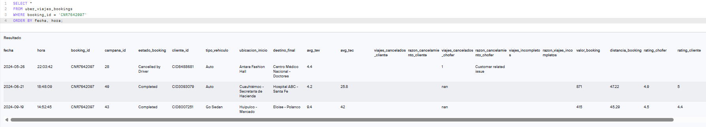
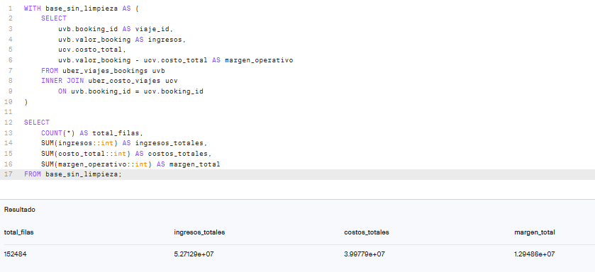
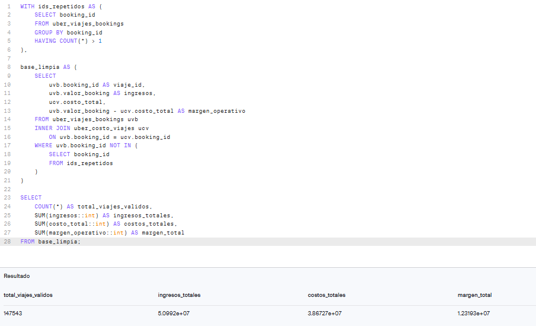
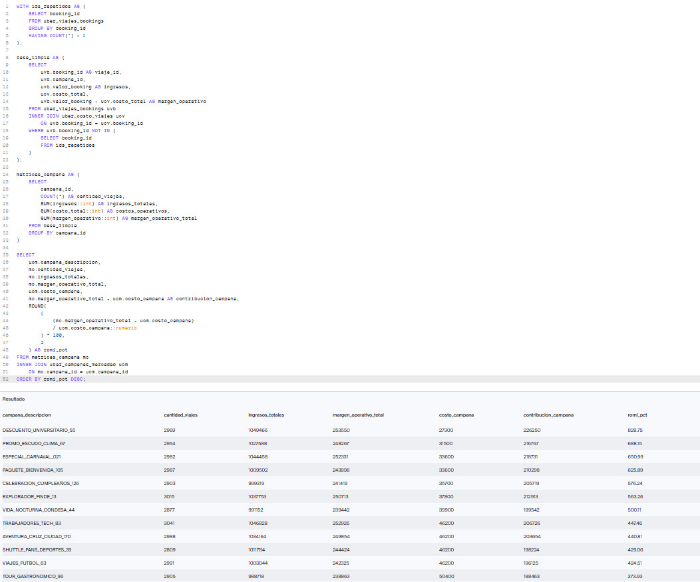

# Uber 2024 | Calidad de Datos SQL y Rentabilidad

Proyecto SQL enfocado en **calidad de datos, rentabilidad operativa y desempeño de campañas de marketing** utilizando datos de viajes de Uber correspondientes a 2024.

El análisis comenzó con una auditoría de calidad de datos que permitió identificar inconsistencias en la principal clave de unión (`booking_id`). Luego de evaluar su impacto, se construyó una base analítica depurada para calcular KPIs operativos y de marketing de manera confiable.

---

## 🎯 Objetivo del proyecto

Los principales objetivos fueron:

- Evaluar la calidad e integridad de tres conjuntos de datos relacionados.
- Identificar problemas que pudieran afectar las uniones y el cálculo de KPIs.
- Construir una base analítica depurada para el cálculo confiable de indicadores.
- Analizar volumen de viajes, ingresos, costos operativos y márgenes.
- Evaluar el desempeño de las campañas de marketing mediante contribución y ROMI.

---

## 🗂️ Fuentes de datos

El análisis se realizó utilizando tres tablas disponibles en el entorno SQL del bootcamp:

| Tabla | Descripción | Registros |
|---|---|---:|
| `uber_viajes_bookings` | Información del viaje, cliente, estado, vehículo, campaña, ingresos y distancia | 150.000 |
| `uber_costo_viajes` | Componentes de pago y costos operativos asociados a cada `booking_id` | 150.000 |
| `uber_campanas_mercadeo` | Descripción y costo de las campañas de marketing | 50 |

El período analizado corresponde al año **2024**.

---

## 🔍 Auditoría de calidad de datos

La primera etapa consistió en validar identificadores, valores nulos, reglas de negocio y consistencia entre las tablas.

### Hallazgo principal: inconsistencia en `booking_id`

Aunque `booking_id` debía identificar cada reserva individual, la auditoría encontró:

- **150.000** filas en la tabla de viajes.
- **148.767** `booking_id` distintos.
- **1.224** identificadores repetidos.
- **2.457** filas asociadas a identificadores repetidos.
- **1.233** ocurrencias adicionales.
- **1.215** identificadores aparecieron dos veces.
- **9** identificadores aparecieron tres veces.

La inspección mostró que estos casos no correspondían a duplicados exactos.

Un mismo `booking_id` podía estar asociado a diferentes:

- fechas y horas,
- clientes,
- campañas,
- tipos de vehículo,
- ubicaciones de origen y destino,
- estados del viaje.

Esto impedía establecer una relación uno a uno confiable entre viajes y costos.



### Hallazgos adicionales de calidad

- `valor_booking` y `distancia_booking` presentaban **48.000 valores nulos**, asociados principalmente a viajes cancelados o no ejecutados.
- Los viajes con estado `Incomplete` presentaban ingresos y distancia, lo que indica viajes iniciados o interrumpidos, y no simples cancelaciones.
- Los componentes de costos operativos presentaban el mismo patrón de **48.000 valores nulos**.
- `costo_total = 0` en esas 48.000 filas, consistente con registros sin actividad operativa.
- No se encontraron inconsistencias entre `costo_total` y la suma de sus componentes.
- La tabla de campañas contenía **50 campañas únicas**, sin identificadores nulos ni costos de campaña inválidos.

Consulta completa de auditoría:

[`01_data_quality_audit.sql`](sql/01_data_quality_audit.sql)

---

## 🧹 Estrategia de limpieza de datos

Una unión directa entre `uber_viajes_bookings` y `uber_costo_viajes` mediante `booking_id` generaba una relación **muchos-a-muchos** para los identificadores repetidos.

### JOIN sin tratamiento

La unión directa produjo:

- **152.484 filas**
- Ingresos: **52.712.901**
- Costos operativos: **39.977.868**
- Margen operativo: **12.948.588**



El problema no podía resolverse seleccionando arbitrariamente uno de los registros repetidos, ya que la tabla de costos no contenía una fecha, cliente u otro identificador que permitiera determinar con certeza qué costo correspondía a cada viaje.

Por esta razón, se tomó la siguiente decisión metodológica:

> **Excluir de la base analítica integrada todos los registros asociados a `booking_id` inconsistentes, manteniendo intactas las tablas originales.**

### Base analítica depurada

Luego del tratamiento:

- **147.543 registros confiables**
- Ingresos: **50.991.953**
- Costos operativos: **38.672.667**
- Margen operativo: **12.319.286**



Al comparar ambos escenarios, el JOIN sin tratamiento sobreestimaba aproximadamente:

- **3,4% de los ingresos**
- **3,4% de los costos operativos**
- **5,1% del margen operativo**

Esto demuestra cómo una inconsistencia relativamente pequeña en una clave de unión puede alterar de manera material los KPIs financieros.

Lógica de limpieza:

[`02_clean_analytical_base.sql`](sql/02_clean_analytical_base.sql)

---

## 📊 Preguntas de negocio

A partir de la base analítica depurada se plantearon cuatro preguntas principales:

1. ¿Cómo se distribuyen los viajes según estado, tipo de vehículo y período?
2. ¿Qué tipos de viaje generan mayores ingresos y margen operativo?
3. ¿Qué campañas concentran mayor volumen de viajes e ingresos?
4. ¿Qué campañas generan el mejor retorno considerando costos operativos y costo de marketing?

---

## 📈 Análisis operativo

### Estado de los viajes

Los viajes `Completed` concentraron la mayor generación de ingresos y margen operativo debido a su volumen.

Los viajes `Incomplete` también generaron ingresos y costos operativos, reforzando la hipótesis de que corresponden a viajes iniciados pero interrumpidos, en lugar de cancelaciones tradicionales.

### Desempeño por tipo de vehículo

**Auto** presentó el mayor ingreso y margen total debido a su volumen de viajes.

Sin embargo, **Go Sedan** obtuvo el mayor margen promedio por viaje, mostrando que el desempeño total y el desempeño unitario deben analizarse por separado.

### Evolución mensual

El comportamiento mensual durante 2024 fue relativamente estable y no mostró una estacionalidad marcada.

**Marzo** registró el mayor margen operativo total del año.

Consultas del análisis operativo:

[`03_operational_analysis.sql`](sql/03_operational_analysis.sql)

---

## 📣 Análisis de campañas de marketing

Para evitar duplicar el costo de una campaña por cada viaje asociado, primero se agregaron los resultados de viajes por `campana_id` y posteriormente se realizó la unión con la tabla de campañas.

### Métricas utilizadas

**Margen operativo**

```text
Ingresos - Costos operativos
```

**Contribución de campaña**

```text
Margen operativo - Costo de campaña
```

**ROMI**

```text
Contribución de campaña / Costo de campaña × 100
```

### Campañas con mayor ROMI

| Campaña | ROMI |
|---|---:|
| `DESCUENTO_UNIVERSITARIO_55` | 828,75% |
| `PROMO_ESCUDO_CLIMA_67` | 688,15% |
| `ESPECIAL_CARNAVAL_021` | 650,99% |
| `PAQUETE_BIENVENIDA_105` | 625,89% |
| `CELEBRACION_CUMPLEAÑOS_126` | 576,24% |

### Campañas con menor ROMI

| Campaña | ROMI |
|---|---:|
| `LANZAMIENTO_CDMX_2024_T3` | -69,70% |
| `AHORROS_PESOS_MX_191` | -53,75% |
| `IMPULSO_ECONOMIA_2024_18` | -40,47% |
| `PRIMER_VIAJE_GRATIS_2024` | -36,49% |
| `MAGIA_NAVIDAD_2024` | -24,99% |



Consultas del análisis de campañas:

[`04_campaign_analysis.sql`](sql/04_campaign_analysis.sql)

---

# 💡 Principales insights

## 1. La calidad de la clave de unión afecta directamente los KPIs financieros

Los `booking_id` inconsistentes generaban relaciones muchos-a-muchos entre viajes y costos.

Como consecuencia, el JOIN sin tratamiento sobreestimaba:

- **3,4% de los ingresos**
- **3,4% de los costos**
- **5,1% del margen operativo**

Esto demuestra que incluso una proporción relativamente pequeña de identificadores inconsistentes puede alterar de forma material los resultados financieros.

---

## 2. Volumen y rentabilidad unitaria muestran perspectivas diferentes

**Auto** presentó el mayor margen operativo total con **3.060.684**, impulsado principalmente por su mayor volumen de viajes.

Sin embargo, **Go Sedan** alcanzó el mayor margen promedio por viaje con **123,45**, a pesar de ocupar el tercer lugar en margen total.

Esto evidencia que:

> **mayor volumen no implica necesariamente mayor rentabilidad por operación.**

---

## 3. Los viajes `Incomplete` también generan actividad económica

Los viajes `Incomplete` registraron:

- **8.849 viajes**
- ingresos por **4.502.183**
- margen operativo de **1.087.666**
- margen promedio de **122,91**

Su margen promedio fue prácticamente equivalente al de los viajes `Completed` (**122,73**).

Esto sugiere que los viajes `Incomplete` corresponden a operaciones iniciadas pero interrumpidas, y no deben analizarse como simples cancelaciones.

---

## 4. El margen operativo mensual presenta relativa estabilidad

Marzo registró el mayor margen operativo del año con **1.087.588** y también la mayor expansión mensual, creciendo **12,54%** respecto a febrero.

Febrero presentó la mayor caída mensual con **-7,93%**.

A partir de mayo, las variaciones fueron generalmente moderadas, lo que no permite identificar una estacionalidad pronunciada con un solo año de información.

---

## 5. Mayor volumen de campaña no garantiza mayor retorno

El análisis de ROMI mostró diferencias importantes entre campañas.

`DESCUENTO_UNIVERSITARIO_55` presentó el mayor ROMI con **828,75%**, mientras que `LANZAMIENTO_CDMX_2024_T3` alcanzó **-69,70%**.

Esto demuestra que:

> **una campaña con volumen o ingresos relevantes puede destruir valor si su inversión supera la contribución generada.**

---

# 🚀 Recomendaciones

## 1. Implementar controles preventivos sobre identificadores críticos

Incorporar validaciones automáticas de unicidad y consistencia sobre `booking_id` antes de ejecutar procesos de integración entre viajes y costos.

Esto permitiría detectar relaciones muchos-a-muchos antes de que afecten reportes financieros o indicadores de rentabilidad.

---

## 2. Fortalecer el modelo de datos con una llave transaccional confiable

La principal limitación del análisis fue no contar con una llave secundaria que permitiera identificar de manera inequívoca cada viaje y su costo asociado.

Se recomienda evaluar la creación de un identificador transaccional único que incorpore o relacione atributos como:

- `booking_id`
- fecha
- cliente
- viaje
- registro de costos

Esto permitiría recuperar registros actualmente excluidos y mejorar la trazabilidad entre fuentes.

---

## 3. Evaluar desempeño de vehículos con métricas de volumen y rentabilidad

Evitar decisiones basadas exclusivamente en margen total.

Auto lidera por contribución total, mientras que Go Sedan presenta mayor margen promedio por viaje.

Se recomienda utilizar conjuntamente:

- cantidad de viajes,
- ingresos,
- margen total,
- margen promedio por viaje.

Esto permitiría diferenciar categorías que generan valor por escala de aquellas que presentan mayor eficiencia unitaria.

---

## 4. Investigar las causas de los viajes `Incomplete`

Dado que los viajes `Incomplete` generan ingresos y presentan un margen promedio similar a los viajes completados, conviene profundizar en sus causas.

Se recomienda analizar variables como:

- motivo de interrupción,
- tipo de vehículo,
- horario,
- ubicación,
- distancia recorrida.

El objetivo sería identificar patrones que permitan reducir interrupciones o recuperar operaciones potencialmente completables.

---

## 5. Revisar campañas con ROMI negativo antes de mantener su inversión

Campañas como:

- `LANZAMIENTO_CDMX_2024_T3`
- `AHORROS_PESOS_MX_191`
- `IMPULSO_ECONOMIA_2024_18`
- `PRIMER_VIAJE_GRATIS_2024`

presentan retorno negativo.

Antes de mantener o aumentar su presupuesto se recomienda revisar:

- segmentación,
- costo de adquisición,
- incentivo promocional,
- contribución generada,
- objetivo estratégico de la campaña.

Una campaña con ROMI negativo no necesariamente debe eliminarse inmediatamente, pero sí requiere justificar si existe un objetivo adicional —como adquisición o penetración— que compense su bajo retorno financiero.

---

## 6. Evaluar escalamiento controlado de campañas con alto ROMI

`DESCUENTO_UNIVERSITARIO_55` presentó un ROMI de **828,75%**.

En lugar de aumentar inmediatamente el presupuesto, se recomienda realizar un escalamiento progresivo y monitorear si el retorno se mantiene a medida que aumenta la inversión.

Esto permitiría evitar asumir que un ROMI elevado permanecerá constante a mayor escala.

---

## 7. Mantener seguimiento temporal antes de concluir estacionalidad

Aunque marzo presentó el mayor margen y la mayor variación positiva mensual, un solo año de información no es suficiente para confirmar un patrón estacional.

Se recomienda incorporar años adicionales y comparar:

- variación mensual,
- comportamiento interanual,
- crecimiento YoY,
- estacionalidad por tipo de vehículo o campaña.

Esto permitiría diferenciar fluctuaciones puntuales de patrones recurrentes.

# ⚠️ Limitaciones

Los datos originales se encuentran disponibles únicamente dentro del entorno SQL del bootcamp y la plataforma no permite exportar los conjuntos completos.

Por este motivo, los archivos fuente con los **150.000 registros** no se incluyen en el repositorio.

El proyecto debe considerarse un:

> **caso analítico documentado y no un pipeline completamente reproducible fuera del entorno original.**

El repositorio contiene:

- consultas SQL,
- evidencias de ejecución,
- documentación de calidad,
- resultados agregados,
- tablas de KPIs,
- documentación complementaria.

### Impacto de excluir registros inconsistentes

La exclusión de los `booking_id` inconsistentes reduce ligeramente la representatividad de la base analítica final.

Sin embargo, debido a que no existe una llave secundaria que permita determinar de forma confiable qué costo corresponde a cada viaje, mantener esos registros habría implicado introducir relaciones potencialmente incorrectas.

Por esta razón se priorizó:

> **confiabilidad de los KPIs sobre conservación artificial de registros cuya relación no podía validarse.**

---

# 🛠️ 7. Herramientas y habilidades aplicadas

### SQL

- CTEs
- `JOIN`
- Subconsultas
- Agregaciones
- `GROUP BY`
- `HAVING`
- Manejo de valores nulos
- Funciones de fecha
- `DATE_TRUNC`

### Window Functions

- `RANK()`
- `LAG()`

### Data Analytics

- Auditoría de calidad de datos
- Validación de claves
- Limpieza y preparación de datos
- Desarrollo de KPIs
- Análisis de rentabilidad
- Análisis temporal
- Análisis de campañas
- ROMI
- Interpretación de resultados
- Recomendaciones de negocio

### Herramientas

- SQL
- Google Sheets

---

# 📂 8. Estructura del repositorio

    uber-2024-sql-data-quality-profitability/
    │
    ├── README.md
    │
    ├── sql/
    │   ├── 01_data_quality_audit.sql
    │   ├── 02_clean_analytical_base.sql
    │   ├── 03_operational_analysis.sql
    │   └── 04_campaign_analysis.sql
    │
    └── images/
        └── evidencias/

---

# 📎 9. Documentación complementaria

El proyecto cuenta con un Google Sheets que contiene:

- diccionario de datos,
- auditoría de calidad,
- impacto de la limpieza,
- KPIs operativos,
- análisis por tipo de vehículo,
- evolución mensual,
- resultados de campañas,
- ROMI.

👉 [Ver documentación y resultados en Google Sheets](TU_LINK_DE_GOOGLE_SHEETS)

Las consultas completas pueden revisarse directamente en la carpeta [`sql/`](sql/).

---

# 👩‍💻 Autora

**Dayana Rodríguez**

Data Analyst | SQL · Python · Power BI · Tableau · Excel

Este proyecto forma parte de mi portafolio de Data Analytics y busca demostrar cómo la **calidad de los datos, el diseño correcto de las relaciones y la interpretación de KPIs** pueden afectar directamente la confiabilidad de las conclusiones y las decisiones de negocio.
